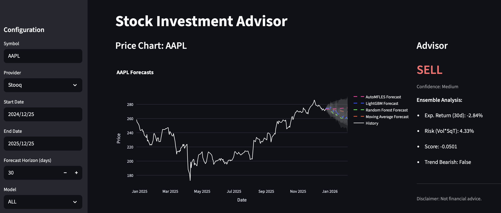
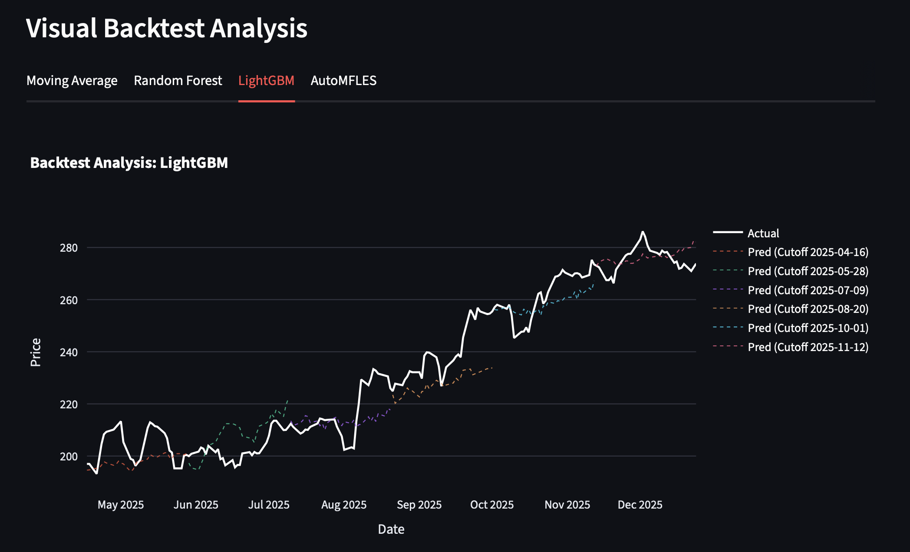

# Stock Investment Advisor

A Python-based investment dashboard for stock price forecasting and analysis.

## Key Features
- **Data Caching**: Local persistence with DuckDB and data fetching from Stooq.
- **Ensemble Forecasting**: Interactive predictions using Moving Average, Random Forest, LightGBM, and AutoMFLES (via Nixtla).
- **Visual Analysis**: Interactive Plotly charts with confidence intervals and historical context.
- **Backtesting**: Robust walk-forward cross-validation with visual performance tracking.
- **Advisor**: Automated Buy/Hold/Sell suggestions based on risk-adjusted return scoring.

## Screenshots

### Forecasting Dashboard

### Visual Backtest Analysis

## Quickstart
1. Install `uv`.
2. Run `uv sync`.
3. Start the app: `uv run streamlit run app.py`.
